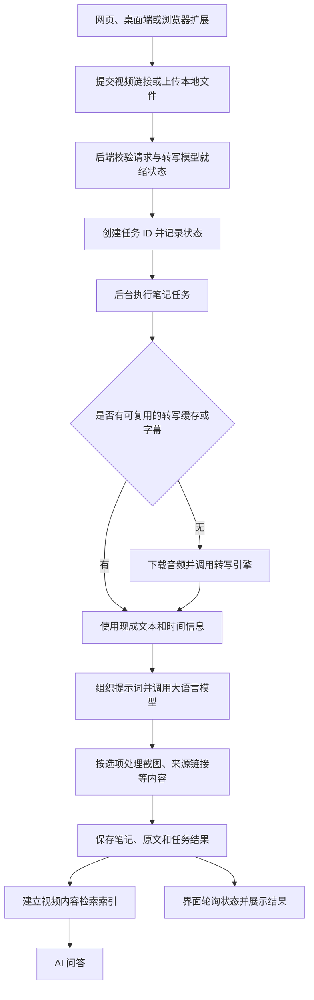

# BiliNote 工作流程与目录用途

本文基于当前仓库代码整理，说明应用的工作流程、各部分职责和主要代码入口，不包含安装与启动步骤。

## 1. 项目整体定位

BiliNote 将视频链接或本地视频转换为结构化 Markdown 笔记，并提供原文查看、思维导图和基于视频内容的 AI 问答。

主要支持 Bilibili、YouTube、抖音、快手和本地文件。截图、原视频时间跳转和多模态视频理解属于可选功能。

项目包含三个用户入口，共用 Python 后端：

| 部分 | 技术 | 职责 |
| --- | --- | --- |
| 网页端 | React 19、TypeScript、Vite、Zustand | 提交任务、展示笔记、管理模型与系统设置 |
| 桌面端 | Tauri、Rust，以及同一套 React 界面 | 提供桌面窗口、管理配套后端进程、打包应用 |
| 浏览器扩展 | Vue 3、TypeScript、Vite、Manifest V3 | 在视频页面发起任务、获取浏览器侧字幕与 Cookie、查看结果 |
| 后端 | Python、FastAPI、SQLAlchemy | 下载、转写、大模型调用、任务执行、存储与检索问答 |

需要区分两类模型：

| 模型类型 | 作用 | 配置入口 |
| --- | --- | --- |
| 音频转写模型，例如 Faster Whisper | 将语音转换成带时间信息的文字 | 设置 → 音频转写配置 |
| 大语言模型 | 将文字整理成笔记、回答问题；支持图像的模型还可用于多模态理解 | 设置 → 模型供应商 |

## 2. 核心工作流程

这是概念流程。截图和视频帧处理会按用户选项穿插在生成过程中，缓存命中也可能跳过部分阶段。

### 2.1 提交与创建任务

- 网页通过 `src/services/` 调用后端接口；浏览器扩展通过自己的 `src/logic/api.ts` 调用同一后端。
- 后端统一将路由挂载到 `/api` 下。
- `POST /api/upload` 接收本地文件，`POST /api/generate_note` 接收笔记生成请求。
- 生成请求包含视频来源、供应商、模型、笔记风格，以及截图、跳转链接等选项。
- 本地转写引擎在提交入口有模型就绪检查；客户端携带 `prefetched_transcript` 时跳过这项检查。
- 后端创建或复用任务 ID，写入任务状态，并通过 FastAPI 后台任务调用执行器。

关键入口：[backend/app/routers/note.py](../backend/app/routers/note.py)。

### 2.2 获取字幕或转写音频

`NoteGenerator` 根据平台选择下载器，并优先利用已有转写缓存或可获取的字幕。浏览器扩展也可以在用户浏览器内抓取字幕后提交给后端。

没有可用文本时，后端下载音频，使用 FFmpeg 进行所需的音视频处理，再调用转写引擎。转写结果包含全文和分段时间信息，供笔记、跳转链接和问答使用。

转写实现包括 Faster Whisper、Groq、必剪、快手、MLX Whisper；实际可用性取决于运行平台、模型文件、凭据和依赖。

关键入口：

- [backend/app/services/note.py](../backend/app/services/note.py)：生成流程编排。
- [backend/app/services/constant.py](../backend/app/services/constant.py)：平台与下载器映射。
- [backend/app/downloaders/](../backend/app/downloaders/)：下载和字幕获取。
- [backend/app/transcriber/transcriber_provider.py](../backend/app/transcriber/transcriber_provider.py)：转写器选择。

### 2.3 大模型生成笔记

后端读取所选供应商与模型配置，组织转写文本、提示词和用户要求，调用大语言模型生成 Markdown。

`app/gpt/` 负责模型适配、提示词构建、长文本分块和生成检查点。开启多模态理解时，还涉及视频帧输入，需要所选模型支持相应能力。

关键入口：[backend/app/gpt/](../backend/app/gpt/)。

### 2.4 保存与展示

- 笔记、转写文本、任务状态及中间结果主要保存到 `note_results/`。
- 截图、封面保存在 `static/`，由后端提供访问。
- SQLite 保存供应商、模型和任务记录等结构化数据。
- 网页端默认每 3 秒轮询任务状态，完成后展示 Markdown、原文、视频信息和思维导图。
- 前端通过 Zustand 管理状态，部分状态持久化到浏览器 IndexedDB。

关键入口：[BillNote_frontend/src/hooks/useTaskPolling.ts](../BillNote_frontend/src/hooks/useTaskPolling.ts)。

### 2.5 AI 问答

笔记生成后，后端尝试为转写文本和视频元信息建立 Chroma 检索索引。问答服务结合检索结果和工具调用回答用户问题。

索引建立失败会记录日志，不影响已生成笔记的保存，但可能影响后续问答能力。

关键入口：

- [backend/app/services/chat_service.py](../backend/app/services/chat_service.py)：问答业务。
- [backend/app/services/chat_tools.py](../backend/app/services/chat_tools.py)：问答工具。
- [backend/app/services/vector_store.py](../backend/app/services/vector_store.py)：文本分块、索引和检索。

## 3. 根目录用途

| 文件或目录 | 用途 |
| --- | --- |
| [backend/](../backend/) | Python 后端及其运行数据 |
| [BillNote_frontend/](../BillNote_frontend/) | React 网页界面和 Tauri 桌面端 |
| [BillNote_extension/](../BillNote_extension/) | Vue 浏览器扩展 |
| [nginx/](../nginx/) | 反向代理配置；`default.conf` 用于多容器，`standalone.conf` 用于单镜像 |
| [doc/](../doc/) | 项目说明使用的截图、宣传图片等 |
| [understanding/](./) | 当前仓库的代码理解文档 |
| `.github/` | 自动构建、发布、提交检查和 Issue/PR 模板 |
| `.vscode/` | 编辑器配置 |
| `.agents/`、`.codex/` | 当前工作区预留的代理工具配置目录，检查时为空 |
| `.git/` | Git 版本历史和仓库元数据 |
| `.env` | 当前端口、路径、默认转写器等环境配置 |
| [.env.example](../.env.example) | 根目录环境变量模板 |
| [docker-compose.yml](../docker-compose.yml) | CPU 版多容器部署：后端、前端和 Nginx |
| [docker-compose.gpu.yml](../docker-compose.gpu.yml) | NVIDIA GPU 版多容器部署 |
| [Dockerfile.complete](../Dockerfile.complete) | 将前后端和 Nginx 打包到一个镜像 |
| [run.bat](../run.bat) | Windows 启动脚本，包含特定 Conda 环境名 |
| [README.md](../README.md) | 功能介绍和部署说明 |
| [CHANGELOG.md](../CHANGELOG.md) | 版本变更记录 |
| [CONTRIBUTING.md](../CONTRIBUTING.md) | 开发贡献约定 |
| [RELEASING.md](../RELEASING.md) | 发布流程 |
| [CLAUDE.md](../CLAUDE.md) | 面向代码助手的项目说明，部分描述需与代码交叉核对 |
| `.gitignore`、`.dockerignore` | Git 与 Docker 构建的忽略规则 |
| `.commitlintrc.json` | 提交信息格式约定 |
| [LICENSE](../LICENSE) | 项目许可证 |

目录名实际是 `BillNote_frontend` 和 `BillNote_extension`，其中为 `BillNote`，与项目名称 `BiliNote` 拼写不同。

## 4. 后端目录用途

### 4.1 源码与工程文件

以下路径相对于 `backend/`。

| 路径 | 用途 |
| --- | --- |
| `main.py` | 启动入口；初始化数据库和配置、设置中间件、挂载静态资源、运行 Uvicorn |
| `app/__init__.py` | 创建 FastAPI 应用并注册 `/api` 路由 |
| `app/routers/note.py` | 任务提交、上传、状态查询等笔记接口 |
| `app/routers/provider.py`、`model.py` | 供应商与模型管理接口 |
| `app/routers/config.py` | 转写模型、下载 Cookie、代理和健康检查等接口 |
| `app/routers/chat.py` | AI 问答接口 |
| `app/services/` | 笔记生成、任务执行、配置管理、模型回退及检索问答业务 |
| `app/downloaders/` | 平台下载器、字幕获取和本地文件处理 |
| `app/transcriber/` | 语音转写引擎、模型注册与下载状态管理 |
| `app/gpt/` | 大模型适配、提示词、长文本分块、检查点等 |
| `app/db/` | SQLAlchemy 连接、DAO、数据库表及内置供应商数据 |
| `app/models/` | 请求及业务数据结构，不是模型权重目录 |
| `app/validators/` | 视频 URL 规范化与支持平台校验 |
| `app/exceptions/` | 业务异常及统一处理 |
| `app/enmus/` | 任务状态、错误码、笔记选项等枚举；目录名保留了原有拼写 |
| `app/utils/` | 日志、截图、视频帧处理、导出、路径与响应包装工具 |
| `app/decorators/` | 耗时统计等装饰器 |
| `app/core/` | 当前仅有初始化文件，属于预留结构 |
| `events/` | 事件信号、处理器及处理完成后的清理逻辑 |
| `tests/` | 下载重试、转写配置、任务执行、文本分块等测试 |
| `fonts/` | 文档渲染字体资源 |
| `requirements.txt` | Python 依赖清单 |
| `.env.example` | 后端子目录中的配置示例，内容与根目录模板不完全一致 |
| `ffmpeg_helper.py` | FFmpeg 定位与可用性检查 |
| `Dockerfile`、`Dockerfile.gpu` | CPU 和 GPU 后端镜像构建 |
| `build.sh`、`build.bat` | 通过 PyInstaller 打包桌面端配套后端 |
| `run.bat` | Windows 后端启动命令 |

### 4.2 运行数据

以下为源码模式从 `backend/` 目录启动时的默认位置，部分可通过环境变量修改。

| 路径 | 内容 |
| --- | --- |
| `bili_note.db` | SQLite 数据库，包含供应商凭据、模型和任务记录等 |
| `config/` | 转写器、Cookie、代理等持久化配置 |
| `models/` | 本地转写模型权重；Whisper 使用 `models/whisper/` |
| `note_results/` | 笔记 JSON、Markdown、转写缓存、任务状态及生成检查点 |
| `static/screenshots/` | 笔记引用的视频截图 |
| `static/cover/` | 视频封面资源 |
| `uploads/` | 用户上传的本地文件 |
| `data/` | 下载缓存、视频帧、导出等处理数据；部分工具会创建更深层子目录 |
| `vector_db/` | Chroma 持久化检索索引 |
| `logs/` | 日志 |
| `__pycache__/`、`.pytest_cache/` | Python 和测试工具生成的缓存 |

这些目录混合了源码和运行结果，理解或备份项目时需要注意区分。

## 5. 网页端与桌面端目录用途

以下路径相对于 `BillNote_frontend/`。

| 路径 | 用途 |
| --- | --- |
| `src/main.tsx`、`src/App.tsx` | React 应用入口及应用装配 |
| `src/pages/HomePage/` | 视频输入、历史、笔记、原文、思维导图和问答界面 |
| `src/pages/SettingPage/` | 模型供应商、转写器、下载、代理、监控和关于页面 |
| `src/pages/Onboarding/` | 首次使用引导 |
| `src/pages/NotFoundPage/` | 未匹配路由页面 |
| `src/layouts/` | 页面布局 |
| `src/components/` | 通用组件、表单、后端状态与启动诊断 |
| `src/components/ui/` | 基础 UI 组件 |
| `src/services/` | 按业务封装后端 API |
| `src/store/` | Zustand 状态管理及浏览器侧持久化 |
| `src/hooks/` | 任务轮询、后端状态检查等可复用逻辑 |
| `src/utils/request.ts` | Axios 实例、API 地址和统一响应处理 |
| `src/utils/`、`src/lib/` | 通用辅助函数和思维导图工具 |
| `src/types/`、`src/constant/` | 类型定义和常量 |
| `src/assets/`、`public/` | 图片、动画等静态资源 |
| `src-tauri/src/` | Rust 桌面入口、窗口与后端进程管理 |
| `src-tauri/tauri.conf.json` | 桌面窗口、开发地址、资源和打包配置 |
| `src-tauri/Cargo.toml`、`Cargo.lock` | Rust 依赖与锁定版本 |
| `deploy/` | 生产环境前端 Nginx 配置及相关脚本 |
| `vite.config.ts` | 开发端口、`@` 别名、构建分包、API 和静态资源代理 |
| `.env.tauri` | Tauri 构建模式环境变量 |
| `package.json` | 前端依赖及 dev/build/lint/preview 命令 |
| `pnpm-lock.yaml`、`package-lock.json` | 包管理器依赖锁文件 |
| `tsconfig*.json`、`eslint.config.js` | TypeScript 和代码检查配置 |
| `tailwind.config.cjs`、`postcss.config.cjs` | 样式工具配置 |
| `Dockerfile` | 构建静态页面并用 Nginx 提供访问 |
| `node_modules/`、`dist/` | 安装依赖和构建产物，不是手写业务源码 |

## 6. 浏览器扩展目录用途

以下路径相对于 `BillNote_extension/`。

| 路径 | 用途 |
| --- | --- |
| `src/popup/` | 工具栏弹窗，读取当前页面并发起任务 |
| `src/options/` | 扩展设置及供应商、转写、下载、监控配置 |
| `src/contentScripts/` | 注入网页的交互界面，例如悬浮入口 |
| `src/background/` | 扩展后台事件和右键菜单等逻辑 |
| `src/sidepanel/` | 侧边栏入口 |
| `src/components/` | Markdown、思维导图、任务进度和聊天等组件 |
| `src/logic/api.ts` | 对共享后端的 API 调用封装 |
| `src/logic/storage.ts` | 扩展设置和任务记录的浏览器存储 |
| `src/logic/bilibili-subtitle.ts` | 浏览器侧 B 站字幕获取 |
| `src/logic/cookies.ts` | 浏览器 Cookie 获取与同步 |
| `src/logic/platform.ts` | 根据 URL 判断视频平台 |
| `src/composables/` | Vue 可复用逻辑，包括扩展存储封装 |
| `src/styles/` | 样式 |
| `src/manifest.ts` | 扩展权限、后台、弹窗、内容脚本和侧边栏声明 |
| `scripts/` | 构建准备、清单生成和辅助逻辑 |
| `vite.config*.mts` | 页面、后台及内容脚本的分入口构建 |
| `unocss.config.ts` | UnoCSS 样式配置 |
| `e2e/`、`playwright.config.ts` | 浏览器端到端测试 |
| `src/components/__tests__/`、`src/tests/` | 单元测试及示例测试 |
| `package.json`、`pnpm-lock.yaml` | 依赖、构建与打包命令 |
| `extension/` | 构建输出，供浏览器加载 |

浏览器扩展直接依赖后端服务，使用扩展时不要求 React 网页界面同时运行。

## 7. 阅读代码时需要注意的差异

1. **任务执行器已改为并发实现。** `task_serial_executor.py` 内部是 `ThreadPoolExecutor`，通过 `TASK_MAX_WORKERS` 控制并发数，默认 3。旧名称和部分“串行执行”注释仍然保留。当前主流程无需额外启动 Redis 或 Celery worker。
2. **数据库默认位置取决于工作目录。** `app/db/engine.py` 默认使用 `sqlite:///bili_note.db`。从 `backend/` 启动时，数据库是 `backend/bili_note.db`；单镜像通过 `DATABASE_URL` 指向 `backend/data/` 下的数据库。
3. **配置 JSON 优先于默认环境变量。** 已保存的 `config/transcriber.json` 优先决定转写器和模型，修改 `.env` 不一定改变现有选择。
4. **字幕优先与模型就绪检查是两个阶段。** 普通请求先经过本地转写模型就绪检查，然后才进入字幕获取流程；携带客户端预取字幕的请求会跳过该检查。因此不能仅凭“视频有字幕”判断普通网页请求无需准备本地模型。
5. **浏览器扩展说明文档落后于实现。** 扩展 README 仍描述 popup MVP，实际已包含侧边栏、Cookie 同步、思维导图和问答代码。
6. **文件存在不等于所有功能均已完整接入。** 例如 `app/utils/export.py` 包含导出工具，但不能据此认定所有导出格式都已在界面和 API 中接通；`/api/delete_task` 当前也仍有未完成持久化删除的 TODO。

## 8. 建议的代码阅读顺序

1. `backend/main.py` → `backend/app/__init__.py`：理解应用启动和路由组织。
2. `backend/app/routers/note.py`：理解任务请求、就绪检查、后台执行和结果接口。
3. `backend/app/services/note.py`：理解核心生成流程。
4. `backend/app/downloaders/` → `backend/app/transcriber/` → `backend/app/gpt/`：分别理解输入获取、语音转写和笔记生成。
5. `BillNote_frontend/src/pages/HomePage/` → `src/services/` → `src/hooks/useTaskPolling.ts` → `src/store/`：理解网页交互与状态更新。
6. `backend/app/services/chat_service.py` → `chat_tools.py` → `vector_store.py`：理解检索问答。
7. 按需阅读 `BillNote_extension/src/` 和 `BillNote_frontend/src-tauri/`，了解扩展与桌面集成。
